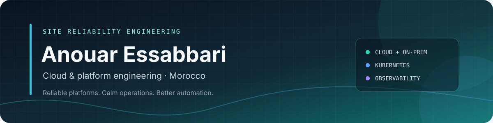
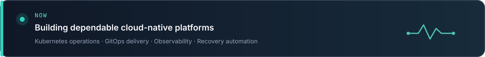

	

	

	
	
	
	
	
	
	
	
	
	

[LinkedIn](https://www.linkedin.com/in/anouar-essabbari-23b612216/) · [Medium](https://medium.com/@anouaressabbari) · [Email](mailto:anouaressabbari@gmail.com)

---

## What I focus on

- **Reliability:** production Linux, highly available Kubernetes, upgrades, disaster recovery, and operational readiness.
- **Automation:** repeatable infrastructure and configuration with Terraform, Ansible, Bash, and Python.
- **Delivery:** CI/CD and GitOps workflows with GitHub Actions, GitLab CI, Jenkins, and Argo CD.
- **Observability:** metrics, logs, traces, and alerting with Prometheus, Grafana, ELK, Loki, and Jaeger.
- **Security:** practical hardening, secrets management, network policies, and admission controls.

## Technology toolkit

| Area | Tools and technologies |
|---|---|
| **Cloud** | AWS (EC2, VPC, IAM, S3), GCP (GKE, Compute Engine), Azure (foundational) |
| **Infrastructure as Code** | Terraform, Ansible, CloudFormation |
| **Containers & orchestration** | Docker, Kubernetes (EKS, GKE, RKE2, kubeadm), Rancher, Helm |
| **CI/CD & GitOps** | GitHub Actions, GitLab CI, Jenkins, Argo CD |
| **Observability** | Prometheus, Grafana, ELK Stack, Loki, Jaeger |
| **Linux & scripting** | Ubuntu, RHEL, CentOS, Bash, Python, Go |
| **Networking** | Nginx, Traefik, HAProxy, Calico, Cilium, Istio |
| **Security & policy** | Vault, Kyverno, OPA, Kubernetes network policies |
| **Data & virtualization** | MongoDB, MySQL, PostgreSQL, Proxmox, KVM |

## How I work

I value automation that reduces operational toil, observability that helps people make decisions, and changes that are safe to deploy and recover. I enjoy collaborating across development and operations, documenting what matters, and contributing to useful open-source projects.

---

**Based in Morocco · Open to thoughtful collaboration**

